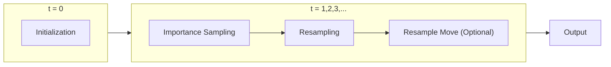

# EPF - Extendable Particle Filter <!-- omit in toc -->

Particle filter has been studied since 20th century. Various improvements are proposed to solve the challenges encountered when applying the filter to real world problems. The main purpose of EPF is to try to implement particle filter in a composable manner, such that it is trivial to change a certain part of particle filter to suit one's need, from adding additional measurement model, to adopting different strategy for resampling step.

# Table of content <!-- omit in toc -->
- [Terminologies](#terminologies)
  - [State-Space Model](#state-space-model)
  - [Particle Filter](#particle-filter)
    - [Importance Sampling](#importance-sampling)
    - [Resampling](#resampling)
    - [Resample-Move](#resample-move)
- [Getting Started](#getting-started)
  - [Dependencies](#dependencies)
  - [Install and run](#install-and-run)
- [How To EPF](#how-to-epf)
- [TODO](#todo)
- [Reference](#reference)

# Terminologies

There are countless of literatures, papers talking about particle filter. Terms may vary according to disciplines. Therefore, it is common to spend a stupid amount of time, only to find that we are referring to different things, despite having same notation, which is extremely frustrating. To avoid that, we start by defining some terms that we will use in the following sections. (TODO: finish it)

## State-Space Model
Consider a general, non-linear state-space model:

$\bf{x}_{t} = f\,(\bf{x}_{t-1}, \bf{u}_{t}, \bf{v}_{t-1})$  
$\bf{y}_{t} = h\,(\bf{x}_{t}, \bf{u}_{t}, \bf{n}_{t})$  

where:

$ \bf{x}_{t} $ : state of the system at time t, with covariance $ \bf{P}_{\bf{x}\bf{x}} $  
$ \bf{y}_{t} $ : observation, with covariance $ \bf{P}_{\bf{y}\bf{y}} $  
$ \bf{u}_{t} $ : input  
$ \bf{v}_{t} $ : process noise, with noise covariance $ \bf{Q}_{t} $  
$ \bf{n}_{t} $ : observation noise with noise covariance $ \bf{R}_{t} $

The general state-space model can be broken down into a state transition and state measuremment model, these two probabilities are calculated during `(unify this term!)` in `epf::ProcesssModel` and `epf::MeasurementModel`, respectively:  

- $ p\,(\bf{x}_t\,|\,\bf{x}_{t-1}\,,\,\bf{u}_{t}) $
- $ p\,(\bf{y}_{t}\,|\,\bf{x}_{t}) $

The estimation of the state $ \bf{x}_{t} $ is expressed as conditional probability, sometimes referred to as belief, $ p\,(\bf{x}_{t}\,|\,\bf{ y}_{1:t},\,\bf{u}_{1:t}) $. Assume that the state $ \bf{x}_{t} $ is *complete* (or is a Markov process), meaning that the past states, measurements, or controls provide no additional information that would help us predict the future more accurately, $ p\,(\bf{x}_{t}\,|\,\bf{ y}_{1:t}\,,\,\bf{u}_{1:t}) $ $ = p\,(\bf{x}_t\,|\,\bf{y}_t\,,\,\bf{u}_t) $, this posterior probability is the target particle filter aims to approximate. (see (Intelligent Robotics and Autonomous Agents) Sebastian Thrun_ Wolfram Burgard_ Dieter Fox - Probabilistic Robotics-Mit Press (2005))

Particle filter is widely used in engineering, such as robotics, signal processing, etc. (reference). Therefore, EPF also implemented some often-used process models and measurement models, see `component\process_model\` and `component\measurement_model\` for more detail (p.s. more implementations are welcome!).

## Particle Filter

Particle filter is a nonparametric implementation of the Bayes filter, it approximates the distribution by a set of random state drawn from it. There are multiple ways to calculate the approximations, the default implementation of EPF (see `epf::ParticleFilter::sample`) follows the structure of the most popular one, the bootstrap filter, also known as Sequential Importance Sampling with Resampling (SISR). The SISR filter can be broken down into two steps, i.e. Importance Sampling and Resampling. (see Particle Filters and Bayesian Inference in Financial Econometrics, THE UNSCENTED PARTICLE FILTER)



### Importance Sampling

As mentioned previously, our goal is to approximate the state at time *t*. Unfortunately, it is often impossible to sample directly from the posterior distribution. However, we can overcome this difficulty by sampling from a known, easy-to-sample, **proposal distribution**, $ q\,(\,\bf{x}_{0:t}\,|\,\,\bf{y}_{1:t}\,) $ , with importance weight $ w_t \propto \frac{p (\bf{y}_{t}|\bf{x}_{t})\,\cdot\,p(\bf{x}_t|\bf{x}_{t-1})}{q(\bf{x}_t|\bf{x}_{0:t-1},\bf{y}_{1:t})} $.

The implementation of the proposal distribution is under directory `component\importance_sampler`, the default importance sampling strategy is $ q(\bf{x}_t|\bf{x}_{0:t-1},\bf{y}_{1:t}) = p(\bf{x}_t|\bf{x}_{t-1}) $, i.e., importance weight $ w_t \propto p (\bf{y}_{t}|\bf{x}_{t}) $, see `component\importance_sampler\default.hpp`

### Resampling

Importance sampling along can't do much since it will degenerate with time (see THE UNSCENTED PARTICLE FILTER), luckily, with the inclusion of resampling stage, particle filter is finally a practical filter. The basic idea is that, resampling stage draws particle from importance sampling according to their importance weight, as the result, particles with higher weights will stay, whereas lower one will be discarded (kinda like the Darwinian idea of survival of the fittest). Different resampling strategies may affect the "performace" of the particle filter (though the author in THE UNSCENTED PARTICLE FILTER found that those do not affect the "performace" of it). Nevertheless, EPF implements different resampling strategy under directory `component\resampler`, the default strategy uses multinomial sampling. (see reference)

### Resample-Move

Resampling stage picks the fittest particles according to importance weight, this means that the resulting particle set may contain multiple copies (or "children" in some literatures) from one particle. This is normally fine because in next iteration, the process noise will kick in, spreading the particles out. However, if the process noise is small... (todo: finish this)

# Getting Started

These instructions will get you a copy of the package up and running on your machine.

## Dependencies

The following libraries are used for EPF (see `cmake\Conan.cmake`), make sure EPF can find them in order to build it:

- range-v3/0.11.0
- eigen/3.4.0
- fmt/9.1.0 (example only)
- Matplot++ (example only)
- gtest/cci.20210126 (test only)

## Install and run

1. clone the repo to desire directory:

``` sh
git clone https://github.com/osjacky430/epf
```

2. build and install the package (todo: finish it)

``` sh
cd epf
cmake -S . -B build
cmake --build build
cmake --install ./build --prefix <directory_to_install_to> --config <config type, e.g. Debug>
```

# How To EPF


# TODO
1. support multi-thread or coroutine (make example benchmarkable first...)
2. make it harder to misuse (this is a bit vague, basically, I need to come back to some classes since some of them should be treated specially, but I haven't think about it thoroughly)
3. make it easy to install, or let user specify what group of header to install (e.g. unscentedPF target, extendedPF target)
4. adapt to ros (this can only be done after #3)
5. more example
6. need to understand prng in c++ library (am I using it correctly?)
7. high dimensional state benchmarking (?)
8. add cmake preset

# Reference
1. particle-filter-tutorial
2. papers.. 